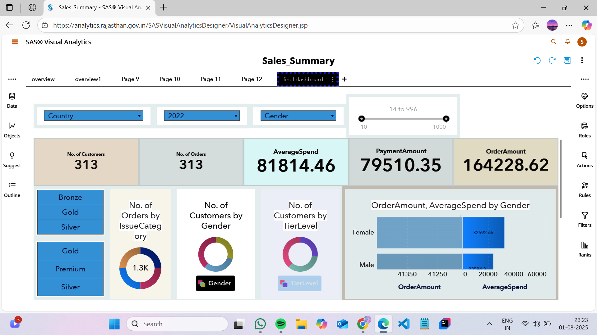
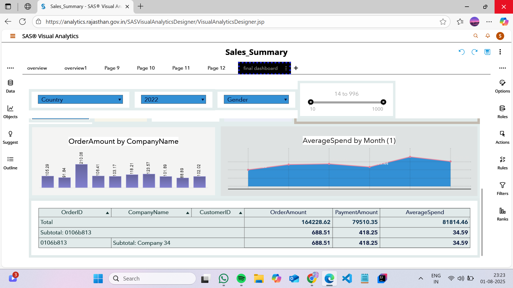

# 📊 Sales Data Integration and Analysis Using SAS

## Overview

This project demonstrates the use of SAS for importing, cleaning, validating, sorting, merging, and analyzing multiple sales-related datasets.

The project integrates customer, order, invoice, payment, shipment, product, loyalty, promotion, and feedback data into a single analytical dataset for reporting and business insights.

---

## Project Objectives

- Import multiple CSV datasets into SAS
- Perform data validation and exploration
- Remove duplicate records
- Sort datasets using common keys
- Merge datasets using DATA Step and PROC SQL
- Create a consolidated dataset for analysis

---

## SAS Skills Demonstrated

- PROC IMPORT
- PROC PRINT
- PROC CONTENTS
- PROC MEANS
- PROC SORT
- DATA Step Programming
- PROC SQL
- Data Cleaning
- Data Integration
- Data Analysis

---

## Project Workflow

1. Import CSV files into SAS
2. Review dataset structure
3. Generate descriptive statistics
4. Remove duplicate observations
5. Sort datasets by key variables
6. Merge related datasets
7. Create final integrated dataset
8. Perform analysis and reporting

---

## Sample Dashboard Images

### Sales Performance Dashboard




## Repository Structure

```text
sas-sales-data-integration/
│
├── Sales.sas
├── images/
│   ├── sales_dashboard.png
│   ├── customer_dashboard.png
│   └── kpi_dashboard.png
└── README.md
```

---

## Key Learning Outcomes

- Working with multiple datasets in SAS
- Data cleaning and preprocessing
- Dataset merging techniques
- SQL joins in SAS
- Building analytical datasets for business reporting
- Dashboard creation and visualization

---

## Author

**Yuvika**

Data Analytics Enthusiast | SAS Programmer
